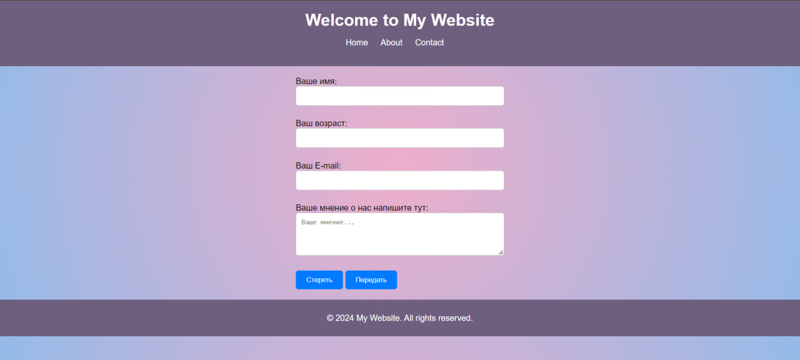

# Лабораторная работа № 8
## Тема: Использование include и require

### Задания
1. Создайте директорию `/views`, в которой будут находиться все ваши представления
   (шаблоны).
2. Внутри директории `/views` создайте поддиректорию `/components`, где будут
   содержаться компоненты ваших страниц.
3. В главной директории проекта создайте файл `index.php`, в котором определите
   основную структуру вашей страницы `(header, main, footer)`.
4. В поддиректории `/components` создайте файл `form.php`, который будет определять
   форму для комментариев (с минимум двумя полями).
5. Создайте директорию `/handlers`, где будете хранить файлы для обработки форм.
6. В директории `/handlers` создайте файл `form-handler.php`, содержащий логику
   сохранения данных формы в файл.
7. В поддиректории `/components` создайте файл `comments.php`, который будет
   отображать сохраненные комментарии.
8. Используя инструкции `include` и `require`, соедините все файлы в `index.php`.
9. По необходимости добавьте другие файлы, например, файлы с дополнительными
   функциями в `/handlers/functions.php`.
10. Дополнительное задание.
    Разработайте класс `Page` с методом `part`, который позволял бы подключать один файл
    `.php` (компонент) к другой странице

## Screenshots
__Содержание страницы__

  
__Вывод содержащего с файла__  
